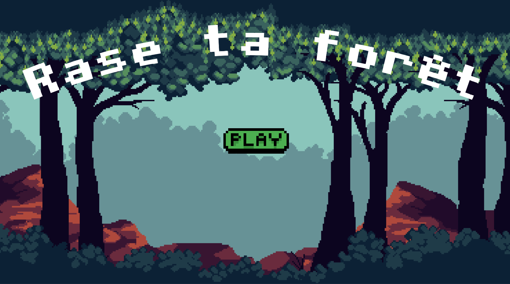

# 🌳 **Rase ta forêt**  

  

## 📖 **Description**  
*Rase ta forêt* est un jeu humoristique et satirique qui pousse à réfléchir sur les **limites de la régénération naturelle**. À travers un gameplay simple mais percutant de type clicker, ce jeu met en lumière les conséquences d'une déforestation incontrôlée. 🌲🚜  

L'idée est de vous amuser tout en explorant des concepts sérieux : jusqu'où peut-on aller avant qu'une forêt ne puisse plus se régénérer ? Et surtout, quand faut-il s'arrêter ? 🌱

Avec son ton décalé et son approche minimaliste, *Rase ta forêt* propose une expérience unique, à la fois éducative et divertissante. Vous pourriez bien découvrir que le véritable défi n’est pas de gagner… mais de savoir quand s’arrêter. 🤯  

## 🎮 **Comment jouer ?**  
🕹️ La façon la plus simple de jouer :  
👉 Rendez-vous sur **[jv2d.borgeaud.online](https://jv2d.borgeaud.online/)** et commencez à explorer (ou à détruire) votre forêt !  

✅ **Objectif** :  
Abattez des arbres pour maximiser vos gains, mais attention : la régénération naturelle a ses limites !  

## 🛠️ **Outils utilisés**  
- ⚡ **Kaboom.js** : un moteur JavaScript pour créer des jeux 2D.  
- 🤖 **ChatGPT** : utilisé pour résoudre des questions de syntaxe et implémenter certaines fonctions, les prompts utilisés sont précisés au sein du code.  

## 🎓 **À propos du projet**  
Ce jeu a été réalisé dans le cadre du cours **Jeu Vidéo 2D** dispensé par **Isaac Pante** au sein de la **Faculté des Lettres** de l’UNIL (Université de Lausanne).  

